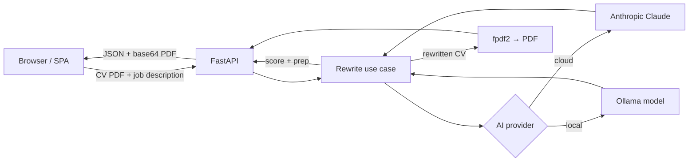

# CV Rewrite

Upload your **CV (PDF)** and a **job description**, and CV Rewrite gives you:

- ✍️ **An honestly rewritten CV** — reframed and re-aligned to the role, **never
  fabricated** — delivered as a downloadable PDF.
- 📊 **A match score report** — an overall score out of 100, a verdict, per-dimension
  scores, honest gaps, and ATS risk flags.
- 🎯 **Interview preparation** — likely questions, talking points, and topics to study
  (when the fit is strong enough).
- 🎓 **A full interview prep guide (PDF)** — one click turns the prep report into a
  complete training guide with model STAR answers grounded in your real experience.

It runs on either **Anthropic Claude** (cloud) or a **local Ollama model** — your
choice, via one environment variable. It can also be hosted publicly with **no
server-side key** — each visitor brings their own (encrypted in their browser).
The whole app ships as a **single Docker image**: FastAPI serves both the JSON API
and the React web app from one port, behind a strict Content Security Policy.

> 📖 **Read the full story:** [I built an open source CV rewriter with Claude and FastAPI — here's what I learned](https://medium.com/@sajanvtech/i-built-an-open-source-cv-rewriter-with-claude-and-fastapi-here-is-what-i-learned-f37a8431bc89)

---

## Contents

- [How it works](#how-it-works)
- [Tech stack](#tech-stack)
- [Repository layout](#repository-layout)
- [Quick start (Docker)](#quick-start-docker)
- [Choosing the AI provider](#choosing-the-ai-provider)
- [Configuration](#configuration)
- [Security and BYOK](#security-and-byok)
- [Docker deployment](#docker-deployment)
- [Local development](#local-development)
- [Using the app](#using-the-app)
- [API reference](#api-reference)
- [Troubleshooting](#troubleshooting)
- [License](#license)

---

## How it works



- The CV is analysed **once**; nothing is stored (no database, no accounts).
- The rewritten CV appears only when the score is **≥ 40**; interview prep only when
  it's **≥ 70**. These honesty thresholds and the scoring rubric live in
  [`api/cv_coach.md`](api/cv_coach.md).
- With **Anthropic**, the CV PDF is sent to Claude natively. With **Ollama**, the CV
  text is extracted first (via `pypdf`) — so *scanned/image* PDFs need Anthropic.

## Tech stack

| Area | Technology |
|------|-----------|
| Backend | FastAPI · Punq (DI) · Clean Architecture · `uv` · Python 3.14 |
| AI | Anthropic SDK (Claude) **or** Ollama (local) — structured JSON output |
| PDF | `fpdf2` (write CVs/guides) · `pypdf` (read CV text for Ollama) |
| Frontend | React 19 · React Router 8 (SPA) · Shadcn UI · Tailwind v4 · Vite · pnpm |
| Packaging | One multi-stage `Dockerfile` · `docker compose` |

## Repository layout

```
cvrewrite/
├── Dockerfile              # single multi-stage build (SPA + API → one image)
├── docker-compose.yml      # one "app" service on port 8000
├── api/                    # FastAPI backend (uv project)
│   ├── main.py             # entry: DI container, routes, security headers, serves the SPA
│   ├── cv_coach.md         # the AI system prompt (rubric, thresholds, rules)
│   ├── .env.example        # copy to .env
│   └── src/
│       ├── domain/         # pure-Python entities, ports, use cases
│       ├── infra/          # Anthropic + Ollama adapters, PDF renderer, settings
│       ├── config/         # Punq container (picks the AI provider)
│       └── api/            # routers + DTOs
└── cvrewriteui/            # React Router SPA (pnpm project)
    └── app/                # routes, components, API client, styles
```

---

## Quick start (Docker)

The fastest way to run everything. You need **Docker** (Desktop or Engine + Compose).

**With Anthropic (cloud):**

```bash
ANTHROPIC_API_KEY=sk-ant-... docker compose up --build
```

**With Ollama (local, no API key):** first run Ollama on your host and pull a model
(`ollama serve`, then `ollama pull llama3.1`), then:

```bash
LLM_PROVIDER=ollama docker compose up --build
```

Open **http://localhost:8000** — the web app and the API docs (`/docs`) are both
there.

> Prefer a file over inline env vars? Create a `.env` in the repo root (Compose reads
> it automatically) — see [Docker deployment](#docker-deployment).

---

## Choosing the AI provider

`LLM_PROVIDER` selects the backend: **`auto`** (default), **`anthropic`**, or
**`ollama`**.

| `LLM_PROVIDER` | Behaviour |
|----------------|-----------|
| `auto` | Uses **Anthropic** when `ANTHROPIC_API_KEY` is set, otherwise **Ollama**. |
| `anthropic` | Always Claude. Requires `ANTHROPIC_API_KEY`. |
| `ollama` | Always a local Ollama model. Requires `ollama serve` + a pulled model. |

So the simple rule: **set an Anthropic key → Anthropic; configure Ollama with no key
→ Ollama**; or force either explicitly.

**Notes**
- Ollama quality depends on the model — use a capable instruct model that honours JSON
  schemas (recent Llama / Qwen / Mistral). Set it with `OLLAMA_MODEL`.
- Local models read **text**, so image-only / scanned PDFs won't work on Ollama — use
  Anthropic for those.

---

## Configuration

All backend settings come from environment variables (or an `api/.env` file for local
runs — copy [`api/.env.example`](api/.env.example)).

| Variable | Default | Required | Purpose |
|----------|---------|----------|---------|
| `LLM_PROVIDER` | `auto` | no | `auto` \| `anthropic` \| `ollama` |
| `ANTHROPIC_API_KEY` | — | for Anthropic | Your Anthropic API key |
| `ANTHROPIC_MODEL` | `claude-haiku-4-5-20251001 `  | no | Claude model ID |
| `MAX_TOKENS` | `16000` | no | Max output tokens per call |
| `OLLAMA_HOST` | `http://localhost:11434` | no | Ollama server URL (Compose default: `http://host.docker.internal:11434`) |
| `OLLAMA_MODEL` | `llama3.1` | no | Local model name (must be pulled) |
| `OLLAMA_NUM_CTX` | `8192` | no | Context window for Ollama |
| `STATIC_DIR` | `static` | no | Directory of the built SPA to serve at `/` (image sets `/app/static`) |
| `CORS_ORIGINS` | `[]` | no | JSON array of allowed origins — only needed if the UI is served from a different origin |

Frontend build-time variable:

| Variable | Default | Purpose |
|----------|---------|---------|
| `VITE_API_URL` | `""` (same origin) | Point the SPA at an API on a different origin (split deploys) |

---

## Security and BYOK

**Security headers.** Every response (API and SPA) carries a strict Content
Security Policy plus `X-Content-Type-Options: nosniff`, `X-Frame-Options: DENY`,
`Referrer-Policy: strict-origin-when-cross-origin`, and a locked-down
`Permissions-Policy`. The CSP uses `script-src 'self'` with per-build SHA-256
hashes for the SPA's inline bootstrap scripts — **no `'unsafe-inline'`**. Fonts
are self-hosted (no third-party CDN), so `font-src` / `style-src` stay
same-origin.

**Bring your own key (BYOK).** You can host CV Rewrite publicly without putting an
Anthropic key on the server — each visitor supplies their own:

- Deploy with `LLM_PROVIDER=anthropic` and **no** `ANTHROPIC_API_KEY`. The app
  then asks each user for their key on first use (the request `GET /api/config`
  reports `requires_api_key: true`).
- The key is encrypted (AES-256-GCM) and stored **only in the user's browser**
  (IndexedDB). It's sent with each request as the `X-Anthropic-Api-Key` header;
  the server uses it only to call Anthropic for that request and never stores or
  logs it.
- When a server key **is** set (or Ollama is the provider), nothing changes — the
  first-use dialog never appears. Users can still optionally supply their own key
  via the **API key** button (top-right).

> BYOK uses the Web Crypto API, which needs a **secure context** — serve the app
> over HTTPS in production (localhost is exempt during development).

---

## Docker deployment

The repo builds to **one image** that serves the SPA and the API together on port
**8000**. The app is **stateless** — no volumes or database required.

### Option A — Docker Compose (recommended)

Create a `.env` file in the repo root (Compose substitutes these automatically):

```dotenv
# Cloud
LLM_PROVIDER=auto
ANTHROPIC_API_KEY=sk-ant-...
# ANTHROPIC_MODEL=claude-haiku-4-5-20251001

# ...or local Ollama (leave the key empty)
# LLM_PROVIDER=ollama
# OLLAMA_MODEL=llama3.1
```

Then:

```bash
docker compose up --build -d      # build + run in the background
docker compose logs -f            # follow logs
docker compose down               # stop
```

App: **http://localhost:8000** · API docs: **http://localhost:8000/docs**

To change the published port, edit the mapping in `docker-compose.yml`
(`"8000:8000"` → e.g. `"80:8000"`).

### Option B — plain Docker

```bash
docker build -t cvrewrite .

# Anthropic
docker run --rm -p 8000:8000 -e ANTHROPIC_API_KEY=sk-ant-... cvrewrite

# Ollama running on the host
docker run --rm -p 8000:8000 \
  -e LLM_PROVIDER=ollama \
  -e OLLAMA_HOST=http://host.docker.internal:11434 \
  --add-host host.docker.internal:host-gateway \
  cvrewrite
```

### Using Ollama from inside the container

A container's `localhost` is **not** your host. To reach an Ollama server running on
the host, use `host.docker.internal`:

- Compose already sets `OLLAMA_HOST=http://host.docker.internal:11434` and adds the
  `host.docker.internal:host-gateway` mapping (needed on Linux; automatic on Docker
  Desktop).
- If you run Ollama in **another container**, put both on the same Docker network and
  set `OLLAMA_HOST=http://<ollama-service>:11434`.

### Behind a reverse proxy (optional)

The app is a single HTTP service on `:8000`, so any reverse proxy (Nginx, Caddy,
Traefik) can terminate TLS and forward to it. Because the UI calls the API on the
**same origin** (relative URLs), no CORS or extra config is needed. Health probe:
`GET /health` → `{"status":"ok"}`.

---

## Local development

Two processes with hot reload: FastAPI for the API, and the Vite dev server for the
UI (it proxies `/api` to FastAPI, so there's no CORS to configure).

**Prerequisites:** [`uv`](https://docs.astral.sh/uv/) (Python 3.14), Node.js 24, and
pnpm (`corepack enable`). Plus an Anthropic key **or** a running Ollama.

```bash
# Terminal 1 — API
cd api
uv sync
cp .env.example .env          # set ANTHROPIC_API_KEY, or configure Ollama
uv run fastapi dev main.py    # http://127.0.0.1:8000

# Terminal 2 — web (dev server with HMR)
cd cvrewriteui
pnpm install
pnpm run dev                  # http://localhost:5173
```

Open **http://localhost:5173**.

### Previewing the production build (no Docker)

`pnpm run build` builds the SPA and copies it into `api/static`, which the API serves
by default:

```bash
cd cvrewriteui && pnpm run build     # builds + copies bundle into ../api/static
cd ../api && uv run fastapi run main.py   # http://127.0.0.1:8000 serves UI + API
```

---

## Using the app

1. **Upload your CV** as a PDF (up to 20 MB), by clicking or drag-and-drop.
2. **Paste the job description.** The more complete it is, the better the result.
3. Click **Rewrite my CV** and wait a few seconds.
4. Review the results:
   - **Match Score Report** — overall score, verdict, per-dimension bars, why-apply /
     think-twice, gaps, and ATS flags.
   - **Rewritten CV** — preview inline and **Download CV** (PDF). An in-app note lists
     anything the rewrite honestly had to omit.
   - **Interview Preparation** (score ≥ 70) — likely questions, talking points, topics.
5. Click **Build prep guide (PDF)** in the Interview Preparation card to generate a
   full training guide (model answers, STAR stories, a study plan, questions to ask,
   and a day-of checklist) and download it.
6. Use **Print match score report** to print/save just the score report.

> If the app is deployed in [BYOK](#security-and-byok) mode, you're asked for your
> Anthropic API key on first use. Manage it anytime via the **API key** button in
> the top-right.

---

## API reference

Interactive docs at `/docs` (Swagger) and `/redoc` when the app is running.

Both `POST` endpoints accept an optional **`X-Anthropic-Api-Key`** header (BYOK);
when present, the server uses that key for the request instead of its own.

### `GET /api/config`

Returns `{ "requires_api_key": bool }` — `true` when the server has no key of its
own and the client must supply one (BYOK). The SPA calls this on load to decide
whether to prompt for a key.

### `POST /api/rewrite`

`multipart/form-data`:

| Field | Type | Notes |
|-------|------|-------|
| `cv` | file | The CV as a **PDF** (≤ 20 MB) |
| `job_description` | text | The target job description |

Returns JSON with `score_report`, `rewritten_cv`, `interview_prep`, and a base64
`pdf_base64` / `pdf_filename` (the last three are `null` below their score thresholds).

### `POST /api/interview-guide`

`application/json` — the client sends back the prior results (`job_description`,
`score_report`, `interview_prep`, `rewritten_cv`). Returns `{ pdf_base64,
pdf_filename }` — the training-guide PDF.

### `GET /health`

Returns `{"status":"ok"}`.

---

## Troubleshooting

| Symptom | Likely cause / fix |
|---------|--------------------|
| `Could not reach the API…` in the UI | The backend isn't running, or (split deploy) `VITE_API_URL` is wrong. |
| `Could not reach Ollama at …` | `ollama serve` isn't running, or in Docker use `host.docker.internal`, not `localhost`. |
| `Ollama error: model … not found` | Pull it first: `ollama pull <OLLAMA_MODEL>`. |
| Ollama returns invalid/garbled results | Use a stronger instruct model, or raise `OLLAMA_NUM_CTX`. |
| "Could not extract any text from the CV PDF" (Ollama) | The PDF is scanned/image-only — use the Anthropic provider. |
| `502` from `/api/rewrite` | Upstream AI error (bad/blocked key, rate limit, refusal). Check the API logs. |
| The app returns `404` at `/` | No built SPA present — build the UI (`pnpm run build`) or run via Docker. |
| `400 No Anthropic API key configured. Provide one via the app.` | [BYOK](#security-and-byok) deployment — enter your Anthropic key in the app's key dialog. |
| The key won't save / "Secure storage is unavailable" | Web Crypto needs a secure context — serve over HTTPS (localhost is fine). |
| `script-src` CSP error after rebuilding the SPA | Restart the API so it recomputes the inline-script hashes from the new `index.html`. |

---

## License

Released under the [MIT License](LICENSE.md) — © 2026 Sajankumar Vijayan.
